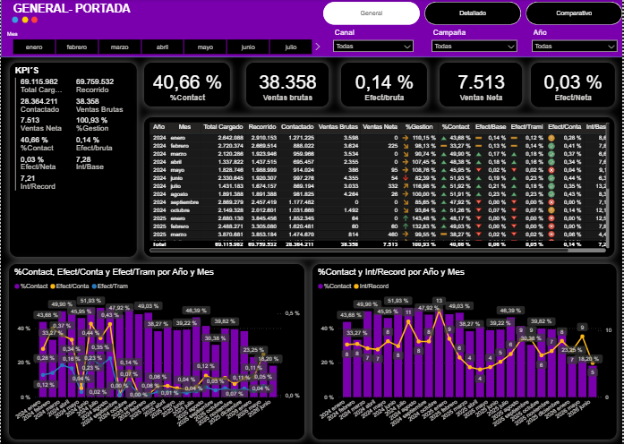
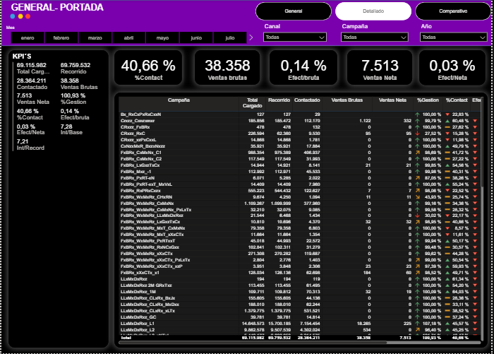
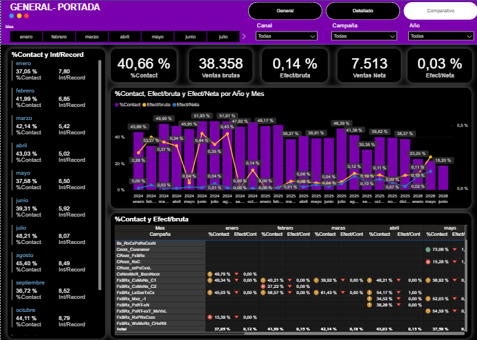
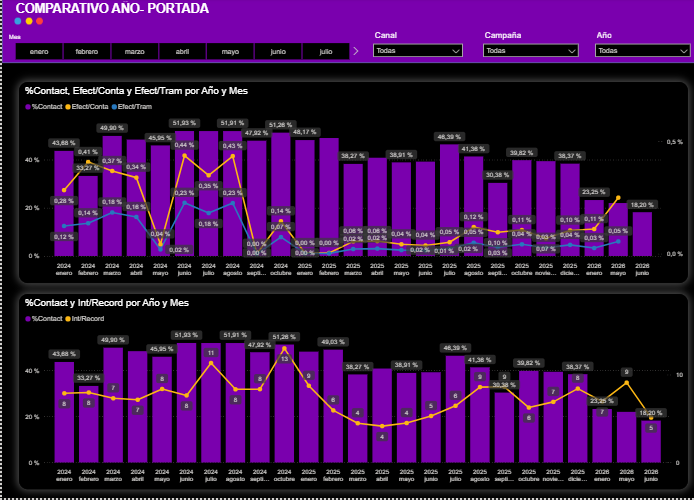
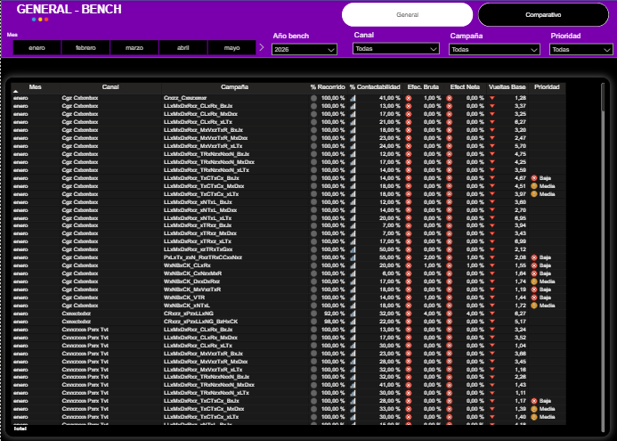
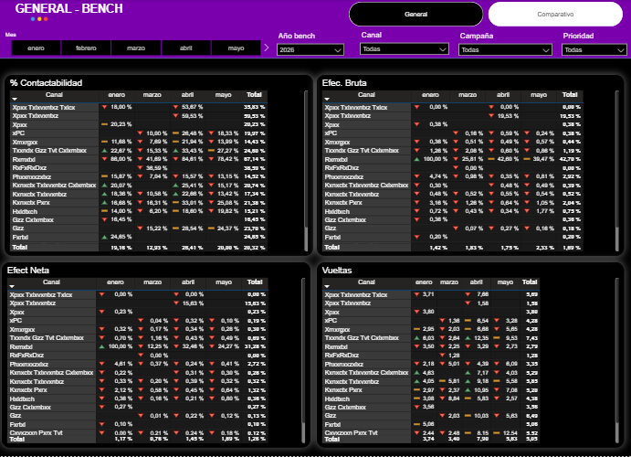
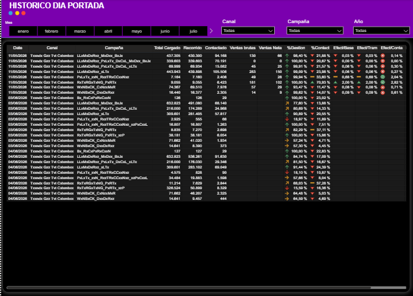
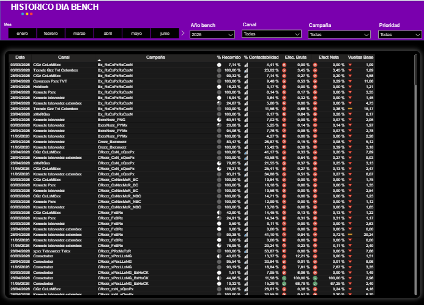

# Portafolio de Business Intelligence - Reporte Corporativo

Bienvenido a la documentación detallada de mi proyecto de Power BI. Este reporte fue diseñado con un enfoque de extremo a extremo, optimizando el modelado de datos y priorizando la experiencia de usuario (UX/UI) para facilitar la toma de decisiones estratégicas.

---

## Estructura y Navegación del Reporte

### 1. Hoja: General Portada
Esta pantalla funciona como el centro de control principal del reporte. Para evitar la saturación visual y permitir una exploración multinivel, implementé un **sistema de navegación por marcadores (Bookmarks)**. Esto permite al usuario alternar entre tres capas de análisis sobre el mismo lienzo con un solo clic:

#### 🔹 Vista 1: Marcador General
Es la vista por defecto de la portada. Está diseñada para la alta gerencia (perfil ejecutivo), mostrando los Indicadores Clave de Rendimiento (KPIs) macro y las tendencias principales de forma directa y limpia.
* **Foco analítico:** Resumen de alto nivel, KPIs principales y comportamiento general.
* *[Inserta aquí tu primera imagen: image_8ad701.png]*

#### 🔹 Vista 2: Marcador Detallado
Diseñada para un perfil más operativo o de supervisión. Al activar este marcador, los gráficos se transforman o desglosan para revelar dimensiones secundarias, permitiendo profundizar en las causas detrás de los números macro.
* **Foco analítico:** Desglose por categorías, comportamiento temporal detallado y apertura de métricas.

#### 🔹 Vista 3: Marcador Comparativo
Esta vista especializada permite realizar análisis cruzados o comparativas (por ejemplo, períodos anteriores, objetivos de la empresa o benchmarks del sector), ayudando a identificar desvíos positivos o negativos de forma visualmente clara.
* **Foco analítico:** Comparativas YoY (Año contra Año), cumplimiento de metas o análisis de variaciones.

### 2. Hoja: Comparativo Año
A diferencia de la portada, esta pantalla está diseñada como una vista consolidada y directa, enfocada completamente en el **análisis evolutivo e interanual (YoY - Year over Year)**. Su objetivo principal es permitirle al usuario evaluar el comportamiento de las métricas clave a lo largo del tiempo y comparar el desempeño entre distintos períodos calendarios sin necesidad de interactuar con marcadores de navegación.

* **Foco analítico:** Identificación de tendencias macro, estacionalidad, comportamiento mensual/trimestral y detección de desvíos históricos en el rendimiento del negocio.
* **Diseño UX/UI:** La distribución limpia de los elementos visuales está optimizada para una lectura fluida, permitiendo cruzar variables de tiempo de forma inmediata y facilitando la comparación visual de picos y valles entre los años evaluados.

### 3. Hoja: General Bench
Esta sección del reporte está dedicada al **Benchmarking Operativo**. Su propósito es evaluar y comparar el rendimiento de las diferentes sedes o segmentos de la operación (analizando métricas clave como Peticiones, TMO y Ausentismo). 

Al igual que en la portada, implementé una navegación por **marcadores (Bookmarks)** para alternar entre el diagnóstico general y el análisis de variaciones sin sobrecargar la pantalla:

#### 🔹 Vista 1: Marcador General
Proporciona una radiografía del estado actual de la operación distribuida. Permite a los líderes operativos identificar rápidamente qué sedes concentran el mayor volumen de trabajo o presentan los indicadores más críticos.
* **Foco analítico:** Distribución de cargas de trabajo, KPIs operativos por sede y tendencias de volumen.

#### 🔹 Vista 2: Marcador Comparativo
Transforma los gráficos principales para centrarse en las brechas de rendimiento. Es ideal para evaluar qué sedes están cumpliendo con los Acuerdos de Nivel de Servicio (SLA) y cuáles presentan desviaciones negativas frente al promedio o los objetivos.
* **Foco analítico:** Análisis de desviaciones, cumplimiento de metas por sede y contraste directo de métricas operativas.

### 4. Hoja: Histórico Día Portada
Esta pantalla ofrece una vista de alta resolución enfocado en el **análisis de granularidad diaria**. Mientras que las secciones anteriores priorizan las tendencias macro y comparativas mensuales o interanuales, esta hoja está diseñada para realizar auditorías detalladas y desglosar el comportamiento del negocio en el día a día.

* **Foco analítico:** Identificación de picos u ofertas operativas inusuales en fechas específicas, análisis del comportamiento de la demanda a lo largo de un mes y evaluación del impacto inmediato de eventos o incidentes específicos en la operación.
* **Diseño UX/UI:** Diseñada como una vista directa y continua sin marcadores intermedios. Su estructura está optimizada para la interacción con segmentadores de tiempo dinámicos, permitiendo al usuario aislar ventanas de días específicas y observar la elasticidad y fluctuación de las métricas de forma inmediata y lineal.

### 5. Hoja: Histórico Día Bench
Como cierre del ciclo analítico, esta hoja fusiona la **granularidad diaria** con el **Benchmarking Operativo**. Su objetivo es permitir la evaluación del comportamiento histórico, día a día, de cada una de las sedes o segmentos en paralelo.

* **Foco analítico:** Monitoreo cruzado de la operación diaria. Es una vista fundamental para aislar problemas: permite detectar rápidamente si un pico de volumen o una caída en el rendimiento afectó a toda la operación en general, o si fue un incidente aislado en una sede específica durante un día puntual.
* **Diseño UX/UI:** Vista consolidada sin marcadores, enfocada en la superposición de tendencias a través de gráficos de líneas y segmentadores dinámicos. Esto facilita la comparación visual inmediata entre múltiples orígenes a lo largo del mes.

