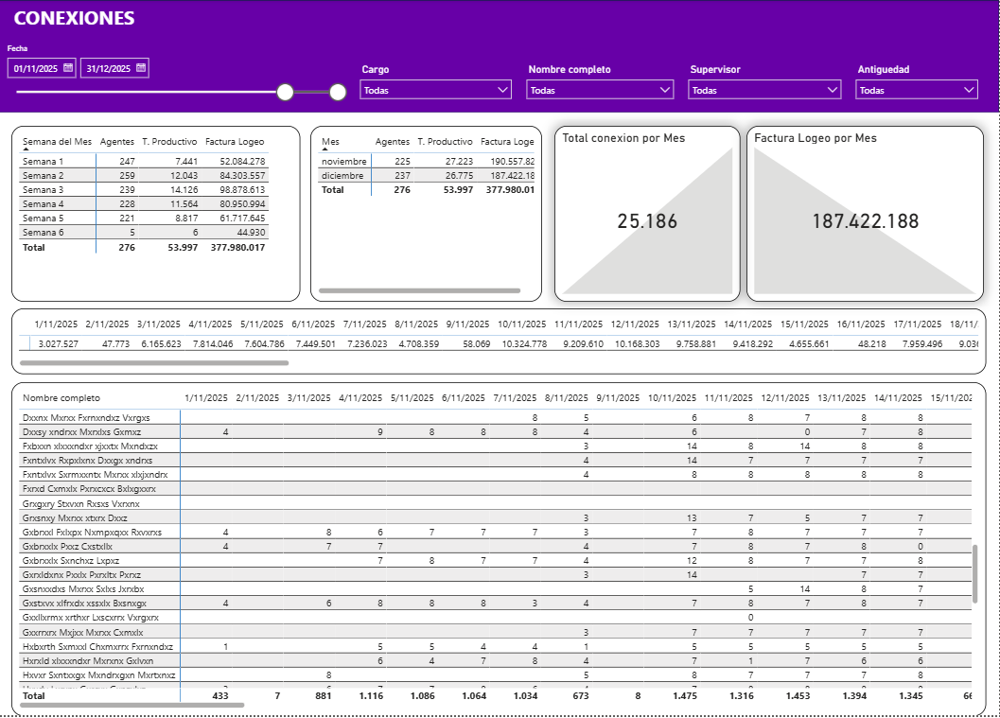

# Dashboard de Gestión de Ventas y Productividad Operativa

Este repositorio contiene un modelo de inteligencia de negocios desarrollado en Power BI, enfocado en el seguimiento integral de una operación de ventas en un Contact Center. El informe permite monitorear el rendimiento a múltiples niveles (mensual, semanal, diario, por supervisor y por agente), evaluando la productividad, el cumplimiento de metas y las tasas de conversión.

## Objetivo del Proyecto
Proveer a los líderes de operaciones y gerentes de ventas una herramienta analítica estructurada para medir la eficiencia del equipo. El dashboard facilita la identificación de oportunidades de mejora en los tiempos de conexión, adherencia y el indicador de Ventas por Hora (SPH), permitiendo decisiones basadas en datos para maximizar el retorno comercial.

## Estructura y Vistas del Informe

El proyecto está segmentado en módulos principales para facilitar la navegación y el análisis. A continuación se detallan las 21 vistas integradas:

### Módulo 1: KPIs Operativos y de Ventas
Análisis del rendimiento general mediante indicadores de tiempo productivo, llamadas, adherencia y ventas (completadas vs. cantadas).

*   **Análisis Mensual:** Comportamiento macro del mes.
    
*   **Análisis Semanal:** Desglose del rendimiento por semanas.
    
*   **Análisis Diario:** Seguimiento táctico del día a día.
    
*   **Rendimiento por Supervisor:** Comparativa de resultados entre líderes de equipo.
    
*   **Rendimiento por Agente:** Detalle individual de métricas operativas.
    

### Módulo 2: Planes de Ventas y Cumplimiento
Seguimiento del valor económico de las ventas frente a los objetivos planificados, analizando los estados de las transacciones.

*   **Plan de Ventas Mensual:** Análisis macro del cumplimiento de la cuota económica a nivel mensual.
    
*   **Plan de Ventas Diario:** Evolución diaria del valor acumulado frente a la meta y estado de los pagos.
    
*   **Análisis por Tipo de Plan:** Desglose de ventas según el producto (planes de internet/telefonía) y operador de origen.
    
*   **Plan de Ventas Detallado:** Matriz de cumplimiento a nivel granular por asesor.
    

### Módulo 3: Conversión y Clasificación de Ventas
Auditoría del estado de las ventas (Activas, Rechazadas, Pendientes) para entender la calidad del cierre comercial y los motivos de caída.

*   **Conversión por Supervisor:** Tasa de efectividad de los líderes y participación por estado.
    
*   **Conversión por Agente:** Tasa de efectividad a nivel individual.
    

### Módulo 4: Control de Conexiones
Monitoreo de la facturación de logueo y tiempos de conexión de la plantilla.

*   **Consolidado de Conexiones:** Auditoría de tiempos productivos diarios y facturación por conexión.
    

### Módulo 5: Análisis Específico de SPH (Sales Per Hour)
Profundización en el indicador principal de eficiencia de ventas, evaluando el SPH Bruto y Neto a través de diferentes dimensiones temporales y operativas.

*   **SPH Mensual:** Tendencia del SPH a lo largo de los meses.
    
*   **SPH Semanal:** Variación del rendimiento por semanas del mes.
    
*   **SPH Diario:** Control táctico diario de las ventas por hora trabajada.
    
*   **SPH por Supervisor:** Consolidado del rendimiento de SPH agrupado por líder.
    
*   **SPH por Agente:** Consolidado del rendimiento de SPH por cada asesor.
    
*   **SPH Detallado:** Matriz de calor y desglose pormenorizado para identificar consistencia en el rendimiento individual.
    

### Módulo 6: Ranking y Cuartiles de Rendimiento
Clasificación del personal operativo en cuartiles (Q1 a Q4) basados en su desempeño, utilizando formato condicional para identificar rápidamente al personal de alto rendimiento y a quienes requieren planes de acción.

*   **Ranking Mensual:** Posicionamiento general en el mes consolidado.
    
*   **Ranking Semanal:** Evolución del posicionamiento semana a semana.
    
*   **Ranking Diario:** Medición precisa del posicionamiento día a día.
    

---

## Arquitectura de Datos y Métricas (DAX)
El modelo incluye procesos de extracción, transformación y carga (ETL), limpieza y cálculos avanzados para determinar la eficiencia operativa a través de medidas estandarizadas en análisis corporativo:

*   **SPH (Sales Per Hour) Neto y Bruto:** Relación entre las ventas logradas y el tiempo productivo real.
*   **Porcentaje de Productividad y Adherencia:** Contraste entre el tiempo planificado (malla de turnos) y el tiempo real de conexión.
*   **Porcentaje de Cumplimiento:** Medición de las ventas completadas contra la cuota o plan asignado.
*   **Cuartiles Dinámicos:** Asignación automática de categoría (Q1-Q4) según la distribución del rendimiento del equipo.
*   **Modelado:** Esquema de tablas de hechos orientadas a eventos (llamadas, ventas, conexiones) relacionadas con dimensiones jerárquicas (Calendario, Empleados, Supervisores, Productos).

---
*Desarrollado para optimización y análisis de datos en entornos corporativos.*